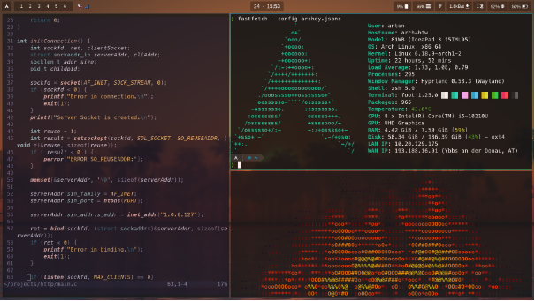

# My Dotfiles

These are my very horrible written configs for my Laptop

## How to use

Firstly:  **WHY?**.

Secondly:

### First way

Or as I like to call it: copy and forget

- Clone repo somewhere

```bash
git clone https://github.com/azok42/dotfiles
```

- Move/Copy files you want to .config directory

```bash
cp -r dotfiles/* ~/.config/ # copy
mv -r dotfiles/* ~/.config/ # move
```

### Second way

Thats how I do it, but I'm stupid, so be careful ig (I dont really know if something can go wrong but still)

- Go to your config directory and make a Git directory out of it

```bash
cd ~/.config/
git init
```

- Add remote and pull

```bash
git remote add origin https://github.com/azok42/dotfiles
git pull origin main
```

Now everything should be good to go

## Software

- Arch
- Hyprland
- Hyprpaper
- Hyprshot
- Hyprpicker
- Hyprlock
- Ly
- Rofi
- Fastfetch
- Neovim
- Librewolf
- Vesktop
- Zsh
- Foot
- Powerlevel10k
- and prob some more i currently dont remember

## Pictures


